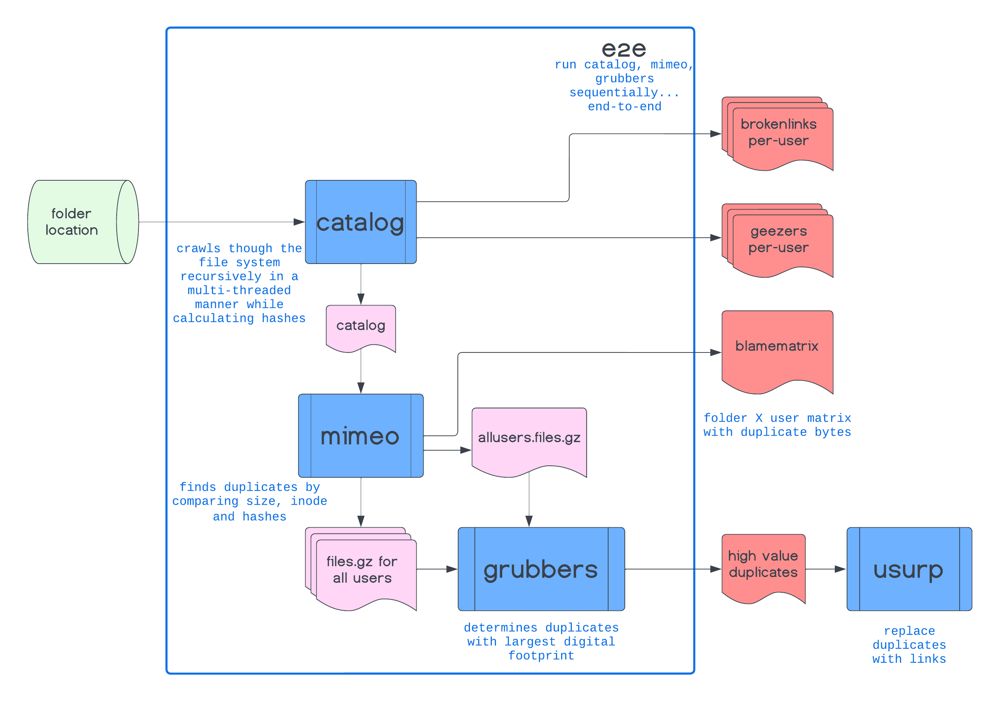

# :rocket: spacesavers2 :rocket:

## Table of Contents:

- [Background](#background)
- [Basic Commands](##spacesavers2-has-the-following-basic-commands)
- [Flow Diagram](#spacesavers2-typical-workflow-looks-like-this)
- [Detailed Documentation](https://ccbr.github.io/spacesavers2)

## Background

Welcome! `spacesavers2`:

- crawls through the provided folder (and its subfolders),
- gathers stats for each file like size, inode, user/group information, etc.,
- calculates unique hashes for each file,
- using the information gathers determines "duplicates",
- reports "high-value" duplicates, i.e., the ones that will give back most diskspace, if deleted,and
- makes a "counts-matrix" style matrix with folders as rownames and users a columnnames with each cell representing duplicate bytes

> New improved parallel implementation of [`spacesavers`](https://github.com/CCBR/spacesavers). `spacesavers` is soon to be decommissioned!

> Note: `spacesavers2` requires [python version 3.11](https://www.python.org/downloads/release/python-3110/) or later and the [xxhash](https://pypi.org/project/xxhash/) library. These dependencies are already installed on biowulf (as a conda env).

## `spacesavers2` has the following Basic commands:

- spacesavers2_catalog
- spacesavers2_mimeo
- spacesavers2_grubbers
- spacesavers2_e2e
- spacesavers2_usurp
- spacesavers2_pdq

## `spacesavers2` typical workflow looks like this:

Check out the detailed [documentation](https://ccbr.github.io/spacesavers2/) for more details. Please reach out to [Vishal Koparde](mailto:vishal.koparde@nih.gov) with queries/comments.

	<a href="#rocket-spacesavers2-rocket">Back to Top</a>

