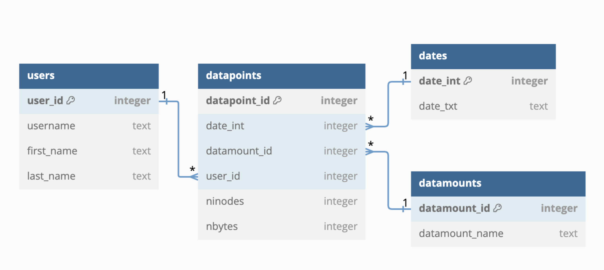

## spacesavers2_pdq_update_db

pdq = Pretty Darn Quick

[`spacesavers2_pdq`](pdq.md) creates TSV (or JSON) file per-datamount per-run (typically per-date). If run daily, this soon creates a lot of files to keep track of. Hence, it is best to save the data in a sqlite db. [`spacesavers2_pdq_create_db`](pdq_create_db.md) command creates the basic schema for that db. Then this command can be used to populate the database.



### Inputs
 - `--tsv`: `.tsv` or `.tsv.gz` created using `spacesavers2_pdq`
 - `--database`: `.db` file created using `spacesavers2_pdq_create_db`
 - `--datamount`: eg. `CCBR` or `CCBR_Pipeliner`
 - `--date`: integer date in YYYYMMDD format

```bash
usage: spacesavers2_pdq_update_db [-h] -t TSV -o DATABASE -m DATAMOUNT -d DATE [-v]

spacesavers2_pdq_create_db: update/append date from TSV to DB file

options:
  -h, --help            show this help message and exit
  -t TSV, --tsv TSV     spacesavers2_pdq output TSV file
  -o DATABASE, --database DATABASE
                        database file path (use spacesavers2_pdb_create_db to create if it does not exists.)
  -m DATAMOUNT, --datamount DATAMOUNT
                        name of the datamount eg. CCBR or CCBR_Pipeliner
  -d DATE, --date DATE  date in YYYYMMDD integer format
  -v, --version         show program's version number and exit

Version:
    v0.13.0-dev
Example:
    > spacesavers2_pdq_update_db -t /path/to/tsv -o /path/to/db -m datamount_name -d date
```

### Output

## updated db file 

sqlite ".db" file with 4 tables is updated.

> NOTE:
>
> - new users are automatically added to "users" table 
> - new datemounts are automatically added to "datamounts" table
> - new dates are automatically added to "dates" table
> - if >0 datapoints exist in the ".db" for a (date + datamount) combination then warning is displayed and no data is appended